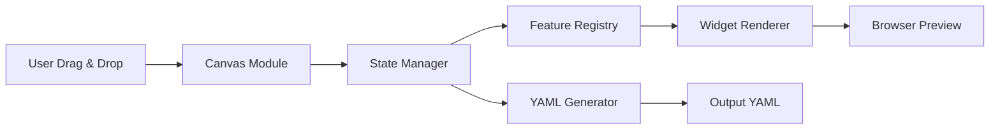

## 🏗️ تحلیل ساختار پروژه `frontend/`

### 📁 **ساختار اصلی پوشه‌ها**

| پوشه/فایل | توضیح |
|-----------|-------|
| **`editor.html`** | فایل اصلی HTML - نقطه شروع برنامه |
| **`editor.css`** | استایل‌های اصلی برنامه |
| **`feature_registry.js`** | رجیستری مرکزی برای ثبت تمام ویجت‌ها |
| **`js/`** | منطق اصلی برنامه (مدیریت state، canvas، export/import) |
| **`features/`** | کتابخانه ویجت‌ها (هر ویجت یک پوشه جدا) |
| **`hardware/`** | پروفایل‌های سخت‌افزاری (YAML configuration) |
| **`materialdesignicons-webfont.ttf`** | فونت آیکون‌های Material Design |

### 🔧 **تحلیل معماری**

این پروژه از یک **معماری ماژولار مبتنی بر Feature Registry** استفاده می‌کند:

```
┌─────────────────────────────────────────────┐
│                editor.html                   │
│  (نقطه ورود - بارگذاری HTML/CSS/JS)        │
└─────────────────┬───────────────────────────┘
                  │
    ┌─────────────┴─────────────┐
    ▼                           ▼
┌─────────┐           ┌─────────────────┐
│  CSS    │           │   JavaScript    │
│ Styles  │           │   Core Logic    │
└─────────┘           └────────┬────────┘
                               │
          ┌────────────────────┼────────────────────┐
          ▼                    ▼                    ▼
┌─────────────────┐ ┌─────────────────┐ ┌─────────────────────┐
│  Feature        │ │     Core        │ │        UI           │
│  Registry       │ │    Modules      │ │    Components       │
│  (ثبت ویجت‌ها)  │ │  (State, Canvas)│ │  (Settings, Modals) │
└────────┬────────┘ └────────┬────────┘ └──────────┬──────────┘
         │                   │                     │
         └───────────┬───────┴─────────────────────┘
                     ▼
            ┌─────────────────┐
            │   ویجت‌های      │
            │   (features/)   │
            │   • lvgl_slider │
            │   • button      │
            │   • progress_bar│
            └─────────────────┘
```

### 📦 **ماژول‌های کلیدی**

1. **`js/core/`** - هسته اصلی برنامه:
   - `state.js` - مدیریت state برنامه
   - `canvas.js` - مدیریت canvas و کشیدن/رها کردن
   - `widget_factory.js` - ایجاد ویجت‌ها
   - `properties.js` - پنل تنظیمات ویجت‌ها

2. **`js/io/`** - عملیات ورودی/خروجی:
   - `yaml_export.js` - تولید کد YAML از طراحی
   - `yaml_import.js` - وارد کردن کد YAML به ویرایشگر
   - `hardware_generator.js` - تولید کانفیگ سخت‌افزاری

3. **`js/ui/`** - کامپوننت‌های رابط کاربری:
   - `device_settings.js` - تنظیمات دستگاه
   - `editor_settings.js` - تنظیمات ویرایشگر
   - `modal_wiring.js` - مدیریت مودال‌ها

### 🎨 **ویجت‌ها (features/)**

ویجت‌ها در پوشه‌های جداگانه سازماندهی شده‌اند. هر ویجت حداقل شامل:
- `render.js` - تابع رندر ویجت در مرورگر
- (برخی) `yaml_export.js` - منطق تولید YAML برای آن ویجت

**دسته‌بندی ویجت‌ها:**
- **LVGL Widgets**: `lvgl_button`, `lvgl_slider`, `lvgl_switch` (26 نوع مختلف)
- **Data Widgets**: `sensor_text`, `progress_bar`, `graph`
- **Media Widgets**: `image`, `icon`, `weather_icon`
- **Layout Widgets**: `shape_rect`, `rounded_rect`, `line`
- **Templates**: `template_nav_bar`, `template_sensor_bar`

### ⚙️ **نحوه اجرای پروژه**

این پروژه یک **برنامه تک‌صفحه‌ای (SPA) خالص** است که در مرورگر اجرا می‌شود:

```bash
# 1. فقط کافی است فایل HTML را در مرورگر باز کنید
firefox ./frontend/editor.html   # یا
google-chrome ./frontend/editor.html

# 2. یا از یک سرور ساده استفاده کنید
cd ./frontend
python3 -m http.server 8000
# سپس در مرورگر: http://localhost:8000/editor.html
```

### 🔄 **جریان داده**



### 🚀 **ویژگی‌های کلیدی پروژه**

1. **طراحی بصری** واسط کاربری ESPHome/LVGL
2. **پیش‌نمایش زنده** در مرورگر
3. **تولید خودکار کد YAML** برای ESPHome
4. **پشتیبانی از سخت‌افزارهای متنوع** (فایل‌های YAML در `hardware/`)
5. **سیستم ماژولار ویجت‌ها** - افزودن ویجت جدید آسان است
6. **مدیریت state پیشرفته** با undo/redo


### 1. **فایل‌های Generator فعلی**:
```
./frontend/js/io/yaml_export.js          # اصلی‌ترین generator
./frontend/js/io/yaml_export_lvgl.js     # generator مخصوص LVGL
./frontend/js/io/hardware_generator.js   # generator سخت‌افزار
```

### 2. **فایل‌های State و Configuration**:
```
./frontend/js/core/state.js              # مدیریت state کلی
./frontend/js/core/constants.js          # ثابت‌های پروژه
./frontend/hardware/                      # پوشه کانفیگ‌های سخت‌افزاری (یک نمونه)
```

### 3. **فایل‌های ویجت نمونه (برای الگو)**:
```
./frontend/features/lvgl_slider/render.js
./frontend/features/lvgl_slider/yaml_export.js (اگر وجود دارد)
```

## 🎯 **برنامه‌ریزی برای اضافه کردن قابلیت‌های جدید**

### **مرحله 1: ساختار پیشنهادی فایل‌های جدید**
```
frontend/
├── js/io/
│   ├── c_code_generator.js      # ✅ جدید - تولید کننده کد C
│   ├── java_code_generator.js   # ✅ جدید - تولید کننده کد Java  
│   ├── live_preview.js          # ✅ جدید - نمایش زنده متغیرها
│   └── variable_manager.js      # ✅ جدید - مدیریت متغیرهای برد
├── core/
│   └── board_variables.js       # ✅ جدید - تعریف متغیرهای خاص برد
└── ui/
    └── code_preview_panel.js    # ✅ جدید - پنل نمایش کد
```

1. **قالب خروجی‌های شما** (چطور کد C/Java تولید می‌کنید)
2. **ساختار داده‌های ورودی** (چه اطلاعاتی از state می‌گیرید)
3. **الگوی نام‌گذاری متغیرها**
4. **نحوه مدیریت پین‌ها و سخت‌افزار**

### **مرحله 3: نمونه‌ای از خروجی مورد نظر شما**

یک **نمونه کوچک** از کدی که می‌خواهید تولید شود بفرستید:
```c
// مثال کد C مورد انتظار
#define TEMP_SENSOR_PIN 4
#define LED_PIN 5

int sensor_value = 0;
float temperature = 0.0;

void read_sensor() {
    sensor_value = analogRead(TEMP_SENSOR_PIN);
    temperature = sensor_value * 0.1;
}
```

یا برای Java:
```java
// مثال کد Java
public class ESP32Board {
    private static final int TEMP_PIN = 4;
    private float currentTemp;
    
    public void readTemperature() {
        // منطق خواندن دما
    }
}
```

## 🔄 **نحوه ادغام با سیستم فعلی**

سیستم فعلی این flow را دارد:
```
ویجت‌ها → State → YAML Generator → خروجی YAML
```

ما می‌خواهیم به این تبدیل شود:
```
ویجت‌ها → State → [YAML Generator, C Generator, Java Generator] → خروجی‌های چندگانه
```
عالی! این کدهای نمونه بسیار باارزش هستند. حالا کاملاً متوجه شدم که چه نوع کدی می‌خواهید تولید کنید. این کدها یک **سیستم embedded کامل با UI** هستند که شامل:

## 🎯 **ویژگی‌های اصلی کدهای شما:**

1. **ماژول‌های LVGL** برای رابط کاربری
2. **مدیریت GPIO** برای کنترل پین‌ها
3. **خواندن سنسورها** (ADC، DHT، DS18B20)
4. **منطق کنترل** (ترموستات، PWM، etc.)
5. **ذخیره‌سازی** در فایل‌ها (JSON)
6. **مدیریت تایمر** و event loop
7. **مدیریت حالت‌ها** (state management)

## 🏗️ **ساختار پیشنهادی برای Generator جدید:**

```
frontend/
├── js/io/
│   ├── embedded_code_generator.js    # ✅ جدید - تولید کننده کد embedded
│   ├── board_config_manager.js       # ✅ جدید - مدیریت کانفیگ برد
│   ├── peripheral_manager.js         # ✅ جدید - مدیریت پریفرال‌ها
│   └── pin_manager.js               # ✅ جدید - مدیریت پین‌ها
├── core/
│   ├── embedded_state.js            # ✅ جدید - state مخصوص embedded
│   └── module_registry.js           # ✅ جدید - رجیستری ماژول‌ها
└── ui/
    ├── embedded_preview_panel.js    # ✅ جدید - پنل پیش‌نمایش کد
    └── pin_assignments_modal.js     # ✅ جدید - مودال تخصیص پین‌ها
```

## 🔄 **نحوه کارکرد Generator جدید:**

### **ورودی‌ها:**
1. **ویجت‌های UI** (از طراحی بصری)
2. **پین‌های اختصاص داده شده** (GPIO, ADC, etc.)
3. **متغیرهای تعریف شده** (sensors, states, etc.)
4. **منطق کنترل** (event handlers, timers)

### **خروجی‌ها:**
```javascript
// 1. کد Embedded (شبیه نمونه‌های شما)
var lv = require('@native.lvgl');
var GPIO = require('@native.gpio');

// 2. کد تنظیمات Hardware
const CONFIG = {
    TEMP_SENSOR_PIN: 21,
    LED_PIN: 32,
    ADC_CHANNEL: 5
};

// 3. کد UI با LVGL
// 4. کد منطق کسب‌وکار
// 5. کد ذخیره‌سازی (اختیاری)
```

## 📝 **الگوی تولید کد:**

بر اساس نمونه‌های شما، ساختار کد این‌طور است:

### **بخش 1: Import ماژول‌ها**
```javascript
var lv = require('@native.lvgl');
var GPIO = require('@native.gpio');
var Timer = require('@native.timer');
var fs = require('@native.fs');
```

### **بخش 2: Configuration**
```javascript
var CONFIG = {
    TEMP_PIN: 21,
    HUM_PIN: 22,
    DHT_TYPE: 22,
    INTERVAL: 2000
};
```

### **بخش 3: UI Components**
```javascript
// ایجاد صفحه و اجزای UI
var scr = lv.lv_scr_act();
var mainContainer = lv.lv_obj_create(scr);
// ...
```

### **بخش 4: State Variables**
```javascript
var currentTemp = 25.0;
var targetTemp = 22.0;
var relayState = false;
var mode_index = 2;
```

### **بخش 5: Event Handlers**
```javascript
lv.lv_obj_add_event_cb(btnPlus, function() {
    targetTemp += 0.5;
    updateDisplay();
}, lv.LV_EVENT_CLICKED, null);
```

### **بخش 6: Main Loop**
```javascript
while (true) {
    // خواندن سنسورها
    // به‌روزرسانی UI
    // بررسی دکمه‌ها
    Timer.delay(100);
}
```

## 🎨 **ویجت‌های جدید مورد نیاز:**

برای پشتیبانی از این کدها، نیاز به ویجت‌های جدید داریم:

### **1. ویجت‌های Embedded:**
```
features/
├── embedded_gpio/
│   ├── render.js
│   └── code_generator.js
├── embedded_sensor/
│   ├── render.js
│   └── code_generator.js
├── embedded_adc/
│   ├── render.js
│   └── code_generator.js
└── embedded_pwm/
    ├── render.js
    └── code_generator.js
```

### **2. ویجت‌های Logic:**
```
features/
├── embedded_timer/
├── embedded_loop/
├── embedded_state_machine/
└── embedded_file_storage/
```

## 🔧 **فایل‌های کلیدی برای شروع:**

### **فایل 1: `embedded_code_generator.js`**
```javascript
// frontend/js/io/embedded_code_generator.js

class EmbeddedCodeGenerator {
    constructor(stateManager) {
        this.state = stateManager;
        this.modules = new Set();
        this.pins = new Map();
        this.variables = new Map();
        this.eventHandlers = [];
    }
    
    generateCode(projectData) {
        const code = {
            imports: this.generateImports(projectData),
            config: this.generateConfig(projectData),
            ui: this.generateUI(projectData),
            variables: this.generateVariables(projectData),
            functions: this.generateFunctions(projectData),
            mainLoop: this.generateMainLoop(projectData)
        };
        
        return this.formatCode(code);
    }
    
    generateImports(projectData) {
        const imports = ['var lv = require(\'@native.lvgl\');'];
        
        if (this.hasGPIO(projectData)) {
            imports.push('var GPIO = require(\'@native.gpio\');');
        }
        
        if (this.hasADC(projectData)) {
            imports.push('var ADC = require(\'@native.adc\');');
        }
        
        if (this.hasTimer(projectData)) {
            imports.push('var Timer = require(\'@native.timer\');');
        }
        
        if (this.hasStorage(projectData)) {
            imports.push('var fs = require(\'@native.fs\');');
        }
        
        return imports.join('\n');
    }
    
    generateConfig(projectData) {
        const configs = [];
        
        // جمع‌آوری پین‌ها
        projectData.widgets.forEach(widget => {
            if (widget.type === 'gpio_output') {
                configs.push(`    ${widget.name}_PIN: ${widget.pin},`);
            } else if (widget.type === 'adc_input') {
                configs.push(`    ${widget.name}_PIN: ${widget.pin},`);
                configs.push(`    ${widget.name}_CHANNEL: ${widget.channel},`);
            }
        });
        
        return `var CONFIG = {\n${configs.join('\n')}\n    INTERVAL: 1000\n};`;
    }
    
    // ... ادامه توابع
}
```

### **فایل 2: `board_config_manager.js`**
```javascript
// frontend/js/io/board_config_manager.js

class BoardConfigManager {
    constructor() {
        this.boards = {
            'esp32': {
                name: 'ESP32',
                pins: this.generateESP32Pins(),
                peripherals: ['GPIO', 'ADC', 'DAC', 'I2C', 'SPI', 'UART'],
                memory: {
                    flash: '4MB',
                    ram: '520KB',
                    psram: 'Optional'
                }
            },
            'esp32-s3': {
                name: 'ESP32-S3',
                pins: this.generateESP32S3Pins(),
                peripherals: ['GPIO', 'ADC', 'DAC', 'I2C', 'SPI', 'UART', 'USB'],
                memory: {
                    flash: '8MB',
                    ram: '512KB',
                    psram: 'Optional'
                }
            }
            // ... بردهای دیگر
        };
    }
    
    generateESP32Pins() {
        const pins = [];
        
        // GPIO Pins
        for (let i = 0; i <= 39; i++) {
            if ([24, 28, 29, 30, 31].includes(i)) continue; // Pins not exposed
            
            const pin = {
                number: i,
                type: 'GPIO',
                functions: [],
                restrictions: []
            };
            
            // Add functions based on pin number
            if (i === 0 || i === 2) {
                pin.restrictions.push('Boot configuration - use with caution');
            }
            
            if ([32, 33, 34, 35, 36, 39].includes(i)) {
                pin.functions.push('ADC');
            }
            
            if ([25, 26].includes(i)) {
                pin.functions.push('DAC');
            }
            
            pins.push(pin);
        }
        
        return pins;
    }
    
    getAvailablePin(boardType, pinType) {
        return this.boards[boardType].pins
            .filter(pin => pin.functions.includes(pinType))
            .map(pin => pin.number);
    }
    
    validatePinAssignment(boardType, pinNumber, functionType) {
        const pin = this.boards[boardType].pins.find(p => p.number === pinNumber);
        
        if (!pin) {
            return { valid: false, error: `Pin ${pinNumber} does not exist on ${boardType}` };
        }
        
        if (!pin.functions.includes(functionType)) {
            return { 
                valid: false, 
                error: `Pin ${pinNumber} does not support ${functionType}` 
            };
        }
        
        return { valid: true, pin };
    }
}
```

## 🚀 **مراحل پیاده‌سازی:**

### **مرحله 1: ایجاد Generator پایه**
1. فایل `embedded_code_generator.js`
2. فایل `board_config_manager.js`
3. فایل `pin_manager.js`

### **مرحله 2: اضافه کردن ویجت‌های Embedded**
1. ویجت GPIO Input/Output
2. ویجت ADC Reader
3. ویجت Sensor (DHT, DS18B20)
4. ویجت Timer

### **مرحله 3: ایجاد رابط کاربری جدید**
1. پنل کد Embedded
2. مودال تخصیص پین‌ها
3. مدیریت ماژول‌ها

### **مرحله 4: یکپارچه‌سازی با سیستم موجود**
1. اضافه کردن تب جدید در خروجی‌ها
2. اتصال state manager به embedded generator
3. تست کامل

## 📋 **فایل‌های اولویت‌دار برای ارسال:**

لطفاً این فایل‌های موجود را برای من بفرستید تا دقیق‌تر شروع کنیم:

1. **`yaml_export.js`** - برای فهمیدن ساختار generator فعلی
2. **`state.js`** - برای فهمیدن state management
3. **هر فایلی که فکر می‌کنید مرتبط است**

┌─────────────────────────────────────────────────┐
│                    فاز ۱                         │
│       تکمیل LVGL + تولید کد C/Java              │
│  • اصلاح رابط کاربری + تب‌های جدید             │
│  • تولید کد C برای LVGL + ESP32                 │
│  • تولید کد Java برای Android/LVGL              │
│  • پنل پیش‌نمایش تعاملی کد                      │
└─────────────────┬───────────────────────────────┘
                  │
┌─────────────────▼───────────────────────────────┐
│                    فاز ۲                         │
│       Embedded Code Generation                  │
│  • ویجت‌های GPIO/ADC/Sensor                     │
│  • مدیریت پین‌ها و سخت‌افزار                    │
│  • تولید کد Embedded JavaScript                 │
│  • شبیه‌سازی در مرورگر                         │
└─────────────────────────────────────────────────┘


+ آدرس گیت‌هاب: https://github.com/hadipic/evm-linux

برای اجرای شبیه ساز به شاخه bsp بروید و در انجا به شاخه سیمولیشن بروید ردمی رو بخوانید این یک راهنمای جامع برای کامپایل و اجرای EVM Simulator روی ویندوز است. در زیر تمام مراحل به زبان فارسی به صورت واضح و گام‌به‌گام توضیح داده شده است :
1. EVM چیست؟

EVM مخفف Embedded Virtual Machine (ماشین مجازی توکار) است، یک چارچوب سازگار موتور اسکریپت‌نویسی عمومی. موتورهای اسکریپت‌نویسی که در حال حاضر پشتیبانی می‌شوند:

    pikascript: یک موتور اسکریپت‌نویسی پایتون فوق سبک.
    quickjs: یک موتور جاوااسکریپت توکار.
    mujs: یک موتور جاوااسکریپت توکار.
    duktape: یک موتور جاوااسکریپت توکار.
    jerryscript: یک موتور جاوااسکریپت توکار.
    quickvm: یک موتور اسکریپت‌نویسی عمومی توکار با کارایی بالا که توسط تیم EVM توسعه یافته است.

2. ساخت اکوسیستم برنامه‌های اینترنت اشیاء EVM
3. چارچوب برنامه کوچک EVUE

EVUE مخفف Embedded VUE است، یک چارچوب برنامه‌نویسی با دستوراتی شبیه به VUE که توسط تیم EVM برای دستگاه‌های توکار طراحی شده است. EVUE نه تنها ویژگی‌های برنامه‌نویسی کارآمد VUE را حفظ کرده، بلکه برای پلتفرم‌های توکار بهینه و سازگار شده است.

    کامپایل آنلاین، بدون کد C
    پشتیبانی از چندین موتور اسکریپت‌نویسی
    پشتیبانی از توسعه با چندین زبان مانند جاوااسکریپت و پایتون
    چارچوب برنامه‌نویسی مبتنی بر داده، با معماری MVVM
    پشتیبانی همزمان از توسعه سناریوهای با رابط کاربری و بدون رابط کاربری

4. چشم‌انداز EVM

    اتصال همه چیز، به لطف ما ساده شد

شکستن مرزهای مهارتی بین اینترنت اشیاء و اینترنت، توانمندسازی شرکت‌ها و توسعه‌دهندگان اینترنت اشیاء با مدل توسعه‌ای کاملاً جدید، کاهش سطح پیچیدگی توسعه اینترنت اشیاء و افزایش سرعت توسعه به شدت.
5. ساختار دایرکتوری کد EVM
فایل/پوشه 	توضیح
bsp 	دایرکتوری سازگاری با بردهای توسعه
components 	دایرکتوری کامپوننت‌های شخص ثالث
docs 	دایرکتوری منابع اسناد و تصاویر
include 	دایرکتوری فایل‌های هدر
engines 	موتورهای اسکریپت‌نویسی
modules 	دایرکتوری ماژول‌ها
test 	کدهای تست
tools 	ابزارهای توسعه
tutorial 	نمونه‌های آموزشی و راهنما
6. راهنمای توسعه

    راهنمای آنلاین EVM در شاپ الکترونیک (www.shpelectronic.ir)

7. مشارکت در کد

    پروژه متن‌باز EVM را در حساب گیت‌هاب خود Fork کنید.
    یک کپی از کد EVM را به صورت محلی Clone کنید.
    پس از ایجاد تغییرات یا افزودن ویژگی جدید، آن را به شاخه راه‌دور (remote) fork شده خود Push کنید.
    یک Pull Request ایجاد کنید و درخواست ادغام تغییرات خود را به شاخه توسعه اصلی EVM ارسال کنید.
    تیم توسعه EVM به طور منظم کدها را بررسی کرده و پس از عبور از تست‌ها، آن‌ها را ادغام می‌کند.

8. پیوستن به EVM

فناوری آینده را می‌سازد. تیم EVM به مشارکت شما نیاز دارد. تیم EVM در حال حاضر از توسعه‌دهندگان جامعه با انگیزه و رویاپرداز برای همکاری در ایجاد اکوسیستم جدید اینترنت اشیاء دعوت به عمل می‌آورد.
صرف نظر از پیشینه فنی شما، می‌توانید سهمی هرچند کوچک در رشد EVM داشته باشید. تیم EVM به گرمی از شما استقبال می‌کند!
8.1 اتحادیه توسعه‌دهندگان اکوسیستم EVM

اتحادیه توسعه‌دهندگان اکوسیستم EVM یک گروه عمیق‌ از علاقه‌مندان و توسعه‌دهندگان است که توسط تیم EVM برای جامعه تشکیل شده است. در اینجا شما می‌توانید:

    همیشه از جدیدترین تحولات فنی EVM مطلع باشید و کارآمدترین روش‌های توسعه اینترنت اشیاء را بیاموزید.
    در تعیین استراتژی آینده و برنامه‌ریزی مسیر توسعه EVM مشارکت کنید.
    از تماس نزدیک و بدون واسطه با تیم EVM بهره‌مند شوید و برای همکاری در آینده به EVM بپیوندید.
    از پشتیبانی فنی رایگان نسخه سازمانی EVM و اشتراک‌گذاری آزادانه راه‌حل‌های فنی متنوع بهره‌مند شوید.


    در صورت منقضی شدن QR کد گروه، لطفاً با شناسه تلگرام @hadipic تماس بگیرید و در یادداشت خود بنویسید: [نام شما] -- علاقه‌مند به ماشین‌های مجازی -- [شهر شما]. شما در اولین فرصت به گروه اضافه خواهید شد. با تشکر!

8.2 فراخوان قهرمانان EVM (EVM Hero Recruitment)

EVM در مرحله رشد سریع استارتاپی قرار دارد. از افراد باانگیزه برای پیوستن و همکاری در گشودن افق جدیدی برای اکوسیستم اینترنت اشیاء استقبال می‌کند!

    اگر به فناوری ماشین‌های مجازی یا نحوه پیاده‌سازی یک زبان برنامه‌نویسی علاقه‌مندید، ما از شما استقبال می‌کنیم.
    اگر درک و تجربه عمیقی از جاوااسکریپت، پایتون و زبان C دارید، ما از شما استقبال می‌کنیم.
    اگر درک عمیقی از RTOSها دارید و یک توسعه‌دهنده حرفه‌ای C هستید که هسته یک یا چند RTOS را به طور عمیق مطالعه کرده‌اید، ما از شما استقبال می‌کنیم.
    اگر بر پروتکل‌های مختلف اینترنت اشیاء و انتقال درایورها مسلط هستید، ما از شما استقبال می‌کنیم.

موقعیت مکانی: نیشابور، شهری که قهرمانان از آن برمی‌خیزند!

علاقه‌مندان می‌توانند رزومه خود را به آدرس ایمیل ارسال کنند: hdi.bashniji@gmail.com. به پیوستن شما خوش‌آمد می‌گوییم! حقوق، سهام، اختیار معامله (آپشن)؛ انتخاب با شما!